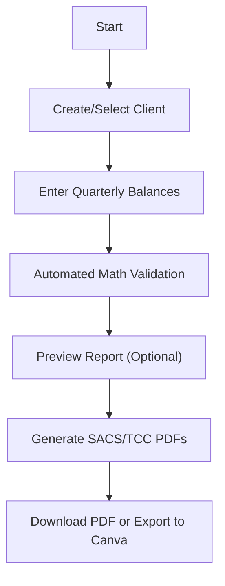

## 1. Product Overview
The AW Client Report Portal is a dedicated internal tool for EF, a financial planning firm, to streamline the creation of high-quality quarterly SACS (Simple Automated Cashflow System) and TCC (Total Client Chart) reports. It replaces a manual, error-prone process involving multiple data sources and manual calculations.
- Centralize client static data and quarterly balances.
- Automate financial calculations and generate pixel-perfect PDF reports matching existing firm branding.

## 2. Core Features

### 2.1 User Roles
| Role | Registration Method | Core Permissions |
|------|---------------------|------------------|
| Team Member (Andrew, Rebecca, Maryann) | Pre-configured / Admin added | Full access to client profiles, data entry, and report generation |

### 2.2 Feature Module
1. **Client Management**: Add/Edit client static info (DOB, SSN, Account Types, Salary, Budget).
2. **Quarterly Data Entry**: Form to enter current balances for various accounts (Pinnacle, Schwab, Zillow, etc.).
3. **Automated Calculations**: Real-time math for inflow/outflow, net worth, and account totals.
4. **Report Generation**: One-click generation of SACS and TCC PDF reports.
5. **Export Options**: Direct PDF download or export to Canva-compatible format.

### 2.3 Page Details
| Page Name | Module Name | Feature description |
|-----------|-------------|---------------------|
| Client List | Dashboard | View all clients, their last report date, and quick action buttons. |
| Client Profile | Static Data Form | One-time setup for names, DOB, SSN, account structures, and recurring financial data. |
| New Report | Balance Entry Form | Pre-populated with static data and last known values; highlights incomplete fields. |
| Report History | History Table | Access previously generated reports for each client. |

## 3. Core Process
The team sets up a client profile once. Every quarter, they "Generate Report" for a client, fill in the dynamic balances (which are automatically summed and processed), and download the finished SACS and TCC PDFs.

## 4. User Interface Design
### 4.1 Design Style
- **Primary Color**: Professional Deep Blue (#003366) and White (#FFFFFF).
- **Secondary Colors**: Success Green (#28A745) for Inflow, Danger Red (#DC3545) for Outflow.
- **Button Style**: Clean, rounded corners, subtle shadows for a modern professional look.
- **Font**: Refined Serif for headers (Playfair Display) and Clean Sans-Serif for data (Inter).
- **Layout**: Sidebar navigation with a spacious main content area; card-based grouping for financial sections.

### 4.2 Page Design Overview
| Page Name | Module Name | UI Elements |
|-----------|-------------|-------------|
| Client List | Client Cards | Grid/List view with status indicators and search functionality. |
| Report Form | Smart Form | Grouped inputs with real-time totalizers and "Use Last Value" shortcuts. |
| PDF Preview | Document Viewer | Side-by-side view of calculated values and template layout. |

### 4.3 Responsiveness
- Desktop-first: Optimized for team use on office computers.
- Adaptive: Clean layout on tablets for portability during meetings.

### 4.4 3D Scene Guidance
- N/A (Business application).
