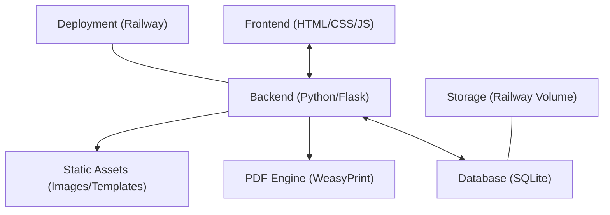
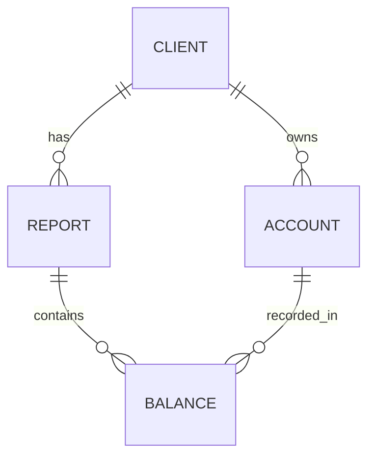

## 1. Architecture Design



## 2. Technology Description
- **Frontend**: Vanilla HTML5, Tailwind CSS for styling, and JavaScript (ES6+) for form interactions and real-time calculations.
- **Backend**: Python 3.10+ with Flask framework.
- **PDF Generation**: WeasyPrint for converting HTML/CSS templates to high-fidelity PDFs.
- **Database**: SQLite for lightweight, file-based data storage.
- **Deployment**: Railway with a persistent volume to ensure SQLite data persists across deployments.

## 3. Route Definitions
| Route | Purpose |
|-------|---------|
| `/` | Dashboard/Client List |
| `/clients` | Client Management (GET/POST) |
| `/clients/<id>` | Client Details & Static Data Edit |
| `/reports/new/<client_id>` | Quarterly Data Entry Form |
| `/reports/generate/<report_id>` | Generate and Download PDF |
| `/reports/canva/<report_id>` | Export to Canva format (Image/Link) |

## 4. API Definitions
### Report Data Schema
```typescript
interface Client {
  id: string;
  name: string;
  dob: string;
  age: number;
  ssn_last_four: string;
  spouse_info?: string;
  monthly_salary: number;
  expense_budget: number;
  accounts: Account[];
}

interface Account {
  id: string;
  type: 'retirement' | 'non-retirement' | 'trust' | 'liability';
  name: string;
  account_number_last_four: string;
  owner: 'client1' | 'client2' | 'joint';
}

interface QuarterlyReport {
  id: string;
  client_id: string;
  date: string;
  balances: { [accountId: string]: number };
  calculated_values: {
    inflow: number;
    outflow: number;
    excess: number;
    net_worth: number;
    // ... other specific totals
  };
}
```

## 5. Server Architecture Diagram
```mermaid
graph LR
  "Browser" -- HTTP --> "Flask Controller"
  "Flask Controller" -- Logic --> "Report Service"
  "Report Service" -- Query --> "SQLite Repository"
  "Report Service" -- Template --> "WeasyPrint"
  "WeasyPrint" -- Binary --> "Browser (PDF)"
```

## 6. Data Model
### 6.1 Data Model Definition


### 6.2 Data Definition Language
```sql
CREATE TABLE clients (
    id INTEGER PRIMARY KEY AUTOINCREMENT,
    first_name TEXT NOT NULL,
    last_name TEXT NOT NULL,
    dob DATE,
    ssn_last_four TEXT,
    monthly_salary REAL,
    expense_budget REAL,
    private_reserve_target REAL,
    created_at TIMESTAMP DEFAULT CURRENT_SERVER_TIME
);

CREATE TABLE accounts (
    id INTEGER PRIMARY KEY AUTOINCREMENT,
    client_id INTEGER,
    account_type TEXT, -- 'retirement', 'non-retirement', etc.
    account_name TEXT,
    account_number_last_four TEXT,
    owner TEXT, -- 'client1', 'client2', 'joint'
    FOREIGN KEY(client_id) REFERENCES clients(id)
);

CREATE TABLE reports (
    id INTEGER PRIMARY KEY AUTOINCREMENT,
    client_id INTEGER,
    report_date DATE,
    status TEXT, -- 'draft', 'completed'
    FOREIGN KEY(client_id) REFERENCES clients(id)
);

CREATE TABLE balances (
    id INTEGER PRIMARY KEY AUTOINCREMENT,
    report_id INTEGER,
    account_id INTEGER,
    balance REAL,
    as_of_date DATE,
    FOREIGN KEY(report_id) REFERENCES reports(id),
    FOREIGN KEY(account_id) REFERENCES accounts(id)
);
```
